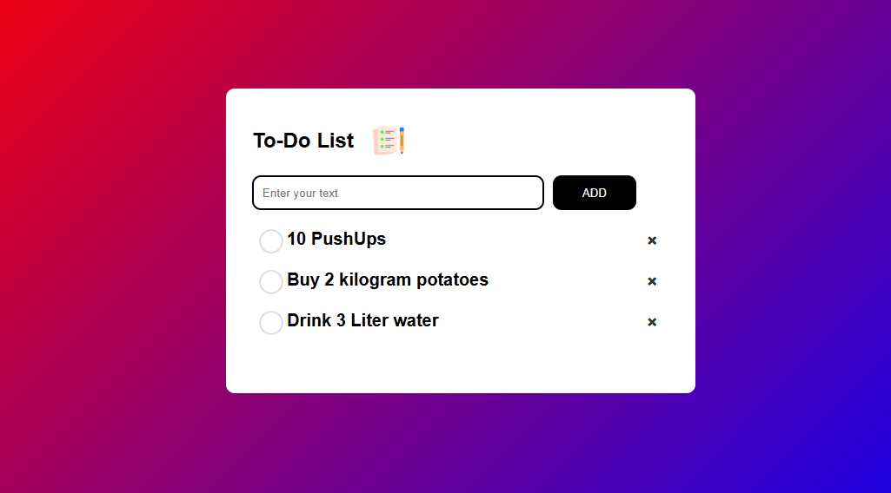

# 📝 To-Do List Website

Welcome to my To-Do List Website project! This project is a simple, yet powerful, to-do list application built using HTML, CSS, and JavaScript. 



## 🌟 Features

- **Add Tasks**: Easily add new tasks.
- **Edit Tasks**: Modify existing tasks.
- **Delete Tasks**: Remove tasks that are completed or no longer needed.
- **Responsive Design**: Works on all device sizes.
- **Animations**: Smooth animations for adding and removing tasks.

## 🌐 Live Demo

Check out the live demo [here](https://helloiamraju.github.io/ToDo-list/
).

## 📂 Project Structure

```plaintext
.
├── index.html
├── styles
│   └── style.css
├── scripts
│   └── main.js
├── images
│   └── (all image assets)
└── README.md
